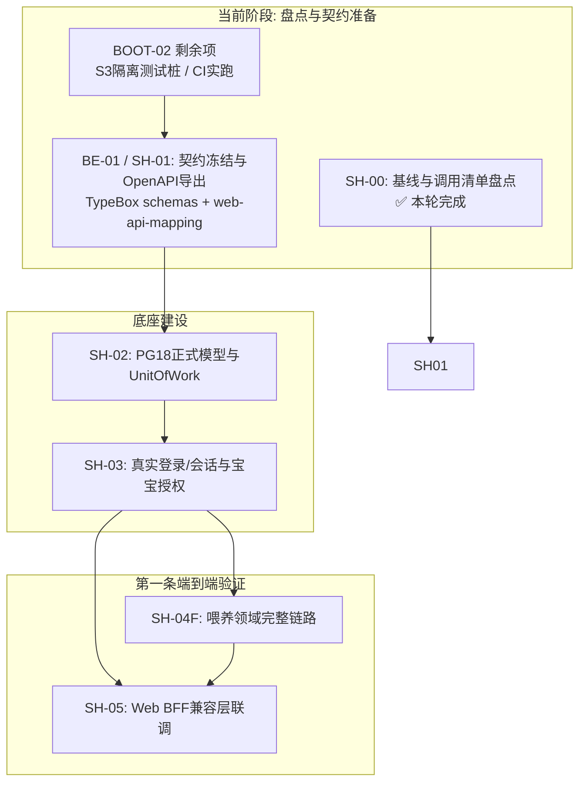

> 当前是待修正的SH-00初稿，不可直接生成业务代码或宣称已验收。已确认错误及修复门槛见 [Codex复核](../../evidence/tasks/SH-00/REVIEW_CODEX.md)，长程任务R0必须先修正。

# 双端共用后端能力状态与就绪矩阵 (Capability Status Matrix)

> 任务对应：`SH-00` / 现状事实审计  
> 规范权威：以 `docs/plan/implementation/09_WEB_IOS_SHARED_BACKEND.md` 为核心分工标准。  
> 状态：代码事实基线（Audit Fact），杜绝将脚本占位或文档规划冒充为已实现。

---

## 1. 状态分类与定义标准

- **已有实现 (IMPLEMENTED)**：代码已编写、通过自动化测试并处于可用状态。
- **仅骨架 (SKELETON)**：代码仅包含空的类/函数声明、生命周期空转或类型桩，无业务执行逻辑。
- **占位脚本 (PLACEHOLDER_SCRIPT)**：`package.json` 中的命令显式指向 `scripts/not-ready.mjs`，执行时退出码非零。
- **缺失 (MISSING)**：尚未创建任何实现文件或端点。
- **已验证 (VERIFIED)**：有脱敏测试日志、集成日志或线上探测证据支持。
- **未验证 (UNVERIFIED)**：有代码或脚本，但缺少真实环境、隔离环境或容量/并发验证。

---

## 2. 三仓库能力就绪全景总表

### 2.1 现有 Web 仓库 (`baby_panel_for_cecilia`)

| 模块 / 能力领域 | 实现状态 | 验证状态 | 代码事实与证据 | 改造缺口 (Shared Backend Gaps) |
|---|---|---|---|---|
| **照护业务 (喂养/睡眠/尿布/辅食/补剂)** | `IMPLEMENTED` | `VERIFIED` | 13 个相关 Route Handler 活跃运行；`tests/api/records.test.ts`、`tests/api/food.test.ts` 全绿。 | 目前直连 SQLite `prod.db`；缺少 BFF 转发层；多处隐式兜底第一宝宝。 |
| **发育与健康 (生长测量/疫苗/病历报告)** | `IMPLEMENTED` | `VERIFIED` | 路由完整，支持 WHO 曲线计算、疫苗选案、病历多图；`tests/api/medical-vaccines.test.ts` 通过。 | 医疗附件直接写入 `public/uploads` 本地目录，未接入 S3 对象存储；无乐观锁版本。 |
| **AI 协同 (聊天/语音记账/日报/OCR)** | `IMPLEMENTED` | `VERIFIED` | `/api/ai/chat`、`/api/agent/voice` 正常，支持 fast-path 与工具调用；`tests/api/agent-voice.test.ts` 通过。 | AI 任务在 Next.js 进程内存中跑，无持久化 TaskOutbox；进程重启易丢任务。 |
| **远程 MCP 协议 (HTTP/SSE)** | `IMPLEMENTED` | `VERIFIED` | `app/mcp/route.ts` 暴露 5 大高聚合工具；`tests/api/mcp-oauth.test.ts` 通过。 | 直连旧 Prisma 读写 SQLite；尚未委托给统一 GrowDesk 业务 API。 |
| **OAuth 2.1 授权服务器** | `IMPLEMENTED` | `VERIFIED` | 支持 RFC 7591 / 7636 / 6749，PKCE S256 单次兑换；`tests/api/mcp-oauth.test.ts` 通过。 | 授权数据与令牌存储在旧 SQLite `OAuth*` 表中，未迁移到 PostgreSQL。 |
| **Web Push 推送与通知** | `IMPLEMENTED` | `VERIFIED` | Web Push 订阅、测试与触发完整；`tests/unit/functional-p1-remaining.test.ts`。 | 缺乏逐宝宝、逐时段的细粒度通知偏好模型。 |
| **静态知识库与配置** | `IMPLEMENTED` | `VERIFIED` | 食材库、绘本库、里程碑、天气 API 完整。 | 天气缓存使用内存缓存，多实例无法共享。 |
| **Next.js 同源 BFF 兼容层** | `MISSING` | `UNVERIFIED` | 尚无 `lib/growdesk/{client,session,compat}/` 目录。 | 核心缺口：需创建受控 HTTP 客户端、BFF 会话管理、CSRF 防护与字段映射器。 |

---

### 2.2 服务端仓库 (`growdesk-server`)

| 模块 / 能力领域 | 实现状态 | 验证状态 | 代码事实与证据 | 改造缺口 (Shared Backend Gaps) |
|---|---|---|---|---|
| **工作区与构建体系** | `IMPLEMENTED` | `VERIFIED` | npm workspace，Node 24 + TS 5.9，`backend:build` 与 `backend:typecheck` 均通过。 | 需集成 OpenAPI 生成流水线。 |
| **基础 HTTP 探针与就绪检查** | `IMPLEMENTED` | `VERIFIED` | Fastify 5 `/health/live` 与 `/health/ready`（真实 PG18 + Redis8 连接探针），503 优雅降级。已部署至 `ampere.zwang.fun:8443`。 | 业务 API 尚未注册（当前业务请求一律 404）。 |
| **多对多授权策略 (08 规范)** | `IMPLEMENTED` | `VERIFIED` | `packages/domain/src/baby-access.ts` 包含纯策略实现；`packages/domain/tests/baby-access.test.ts` 13/13 通过。 | 尚未结合 PostgreSQL 真实事务和 Repository 落地。 |
| **云同步门禁策略 (07 规范)** | `IMPLEMENTED` | `VERIFIED` | `packages/domain/src/cloud-sync-policy.ts`；11/11 测试通过。 | 尚未接入持久化 `DeviceSyncBinding` 表与 Change Feed 游标。 |
| **Worker 进程 (`apps/worker`)** | `SKELETON` | `VERIFIED` | 仅具备 idle 生命周期、配置加载与 SIGTERM 响应；`apps/worker/tests/lifecycle.test.ts` 通过。 | 缺少实际 BullMQ 5 业务队列消费者（AI、OCR、通知）。 |
| **Scheduler 进程 (`apps/scheduler`)** | `SKELETON` | `VERIFIED` | 仅具备 idle 生命周期与 SIGTERM 响应；`apps/scheduler/tests/lifecycle.test.ts` 通过。 | 缺少定时任务（日报生成、归档清理、对账检查）。 |
| **契约导出命令 (`backend:contracts:*`)** | `PLACEHOLDER_SCRIPT` | `VERIFIED` | `package.json:25-26` 明确指向 `node scripts/not-ready.mjs backend:contracts:generate BE-01`，退出码 1。 | **占位**：需在 BE-01 真正集成 TypeBox 导出与 OpenAPI 3.0.3。 |
| **数据库命令 (`backend:db:*`)** | `PLACEHOLDER_SCRIPT` | `VERIFIED` | `package.json:27-29` 明确指向 `node scripts/not-ready.mjs backend:db:migrate BE-02`，退出码 1。 | **占位**：需在 BE-02 真正落地 PostgreSQL 迁移与 Prisma 7 客户端。 |
| **契约库 (`packages/contracts`)** | `SKELETON` | `VERIFIED` | 仅包含 `HealthLiveResponseSchema` 与 `HealthReadyResponseSchema` 两个基础类型。 | 缺失全部业务契约（Auth, Baby, Records, Sync, Task, MCP）。 |
| **历史数据私有归档 (`LEGACY_IMPORT`)** | `IMPLEMENTED` | `VERIFIED` | 提交 `e00cedc` 已在目标 PG 导入 5 用户、1 家庭、1 宝宝及 1311 行历史私有档案。 | **非业务表**：档案存在于 `legacy_import` schema，API 无权读取；`businessHistoryReady: false`。且导入脚本具非空库拒绝保护，不能直接用于增量同步。 |
| **正式业务 API / 端点** | `MISSING` | `UNVERIFIED` | 尚未编写业务 route / service。 | 需在 SH-03、SH-04、SH-05 等任务分领域交付。 |
| **私有 S3 对象存储接入** | `MISSING` | `UNVERIFIED` | 尚未编写 S3 适配器与上传/下载凭据生成。 | 需在 SH-06 任务交付。 |

---

### 2.3 原生端仓库 (`growdesk-ios`)

| 模块 / 能力领域 | 实现状态 | 验证状态 | 代码事实与证据 | 改造缺口 (Shared Backend Gaps) |
|---|---|---|---|---|
| **本地持久库 (Local Vault)** | `IMPLEMENTED` | `VERIFIED` | 基于 GRDB 的本地资料库，支持本地记录新增、查询、附件存储与备份导出。 | 纯本地运行，与云端服务解耦。 |
| **云端 API 客户端** | `MISSING` | `UNVERIFIED` | 尚未生成基于 OpenAPI 快照的 Swift 客户端代码。 | 需在 IOS01 / SH-10 任务从已验收 OpenAPI 生成。 |
| **原生账号与会话管理** | `MISSING` | `UNVERIFIED` | 尚未实现登录、Keychain 令牌保存与原子刷新。 | 需在 SH-10 落地。 |
| **双向云同步引擎** | `MISSING` | `UNVERIFIED` | 尚未实现 Change Feed 拉取、变更排队、冲突处理与版本升级。 | 需在 SH-09 与 SH-10 协同落地。 |

---

## 3. 脚本占位与伪装防护说明

为防止后续开发将未完成的脚本误判为可用能力，特别核实以下命令现状：

```bash
# 执行结果核实：
$ npm run backend:contracts:generate
> node scripts/not-ready.mjs backend:contracts:generate BE-01
[NOT READY] Task BE-01 has not been implemented yet. Run after completing prerequisites.
Exit code: 1

$ npm run backend:db:migrate
> node scripts/not-ready.mjs backend:db:migrate BE-02
[NOT READY] Task BE-02 has not been implemented yet. Run after completing prerequisites.
Exit code: 1
```

- **结论**：`growdesk-server` 中的契约生成与数据库迁移命令目前**均为明确的占位桩**，任何声称“OpenAPI 契约已生成完毕”或“PG 业务表已迁移完成”的断言均属不实。必须先完成 `BOOT-02` 剩余项与 `BE-01/BE-02`。

---

## 4. 关键缺口与开工前置依赖总结



1. **SH-01 的准确前置**：
   - 依赖本轮 SH-00 的调用清单 (`web-call-inventory.csv`) 与映射初稿 (`web-api-mapping.md`)；
   - 依赖 `growdesk-server` 的 BOOT-02 补齐（S3 mock / 隔离测试闭环）；
   - 在 `growdesk-server` 的 `packages/contracts/src` 注册所有 128 个端点的 TypeBox 规范，替换 `scripts/not-ready.mjs`。
2. **SH-05 (Web BFF) 的准确前置**：
   - 必须等待服务端 SH-01 契约冻结、SH-02 PG 事务模型、SH-03 真实会话、SH-04F 喂养端点就绪；
   - 允许在独立端口（非 3088）建立隔离 Web BFF 测试实例，严禁提前切生产。
