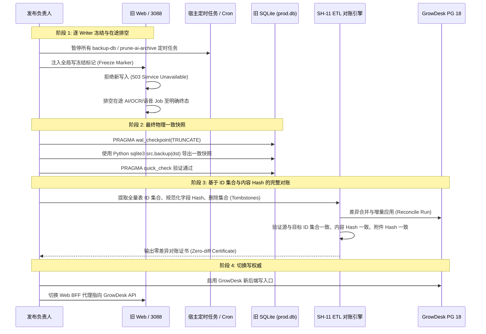

# 生产写入口全景清单与可达性审计 (R0 修正稿)

> 任务对应：`SH-00 (R0 语义修复)` / 迁移安全基线  
> 规范权威：以实际旧源码 `lib/**`、`prisma/schema.prisma` 与服务端规范 `docs/plan/implementation/02_BACKEND_CONTRACTS.md`、`03_DATABASE_MIGRATION.md`、`09_WEB_IOS_SHARED_BACKEND.md` 为准。  
> 状态：代码审计事实与安全规格（Audit Baseline & Reachability Matrix）。

---

## 1. 现状事实与写权威界限

1. **当前旧 Web (`baby_panel_for_cecilia`) 仍是唯一的真实照护业务写权威**：
   - 生产环境通过 systemd 管理的 `baby-panel.service`（端口 3088）直接读写物理权限为 600 的 SQLite 数据库（`file:./prod.db`）。
   - `growdesk-server` 在 2026-09-12 部署的基础容器栈仅开放了 `/health/live` 与 `/health/ready`（业务路径全部 404），**完全不具备业务写能力**。
2. **写入口不仅存在于前端页面与标准 HTTP 路由**：
   - Web 路由 (`app/api/**`) 只是显式入口之一；
   - 内部还存在 **AI Agent 工具闭包**、**远程 MCP 服务端**、**Stdio MCP 独立进程**、**OAuth 2.1 凭据引擎**、**后台归档逻辑**以及**运维 Shell 脚本**。
3. **数据库模型准确性核准 (Prisma SQLite Schema)**：
   - 旧数据库**不存在** `AiDailySummary`、`AiTip`、`OAuthToken` 模型；
   - AI 日报生成通过 `archiveText` 写入 `AiArchive` 表及磁盘文件；
   - 育儿贴士通过内存中的 LRU Cache 缓存，不写持久表；
   - OAuth 持久化模型为 `OAuthClient`、`OAuthAuthorizationCode`、`OAuthRefreshToken`、`OAuthConsent`、`OAuthAuditLog`。

---

## 2. 非路由与间接写入口详细审计

### 2.1 AI Agent 工具闭包 (`lib/agent/tools/**`)
- **写入机制**：通过统一工具分发器 `lib/agent/tools.ts:executeTool()` 调用各领域写方法，直接调用 Prisma SQLite Client 或底层 `lib/records/service.ts`。
- **实际存在的工具文件核对**：
  1. `lib/agent/tools/feeding.ts`：写入 `FeedingRecord`、`RecordSnapshot`。
  2. `lib/agent/tools/food.ts`：写入 `FoodLogRecord`、`FamilyFoodStatus`。
  3. `lib/agent/tools/nutrition.ts`：写入 `SupplementRecord`、`RecordSnapshot`。
  4. `lib/agent/tools/diaper.ts`：写入 `DiaperRecord`、`RecordSnapshot`。
  5. `lib/agent/tools/sleep.ts`：写入 `SleepRecord`、`RecordSnapshot`。
  6. `lib/agent/tools/growth.ts`：写入 `GrowthMeasurement`。
  7. `lib/agent/voice-fast-path.ts`：写入 `AgentVoiceLog`，并直接或委托上述工具写入业务记录。
  *(注：`lib/agent/tools/` 目录下不存在 `medical.ts`，医疗病历仅通过 Web 路由上传与 OCR 写入。)*
- **生产可达性**：`ACTIVE_IN_PRODUCTION`（用户在 Web 页面使用 AI 助手聊天框、语音助手发指令时直接触发）。

### 2.2 远程 MCP 服务端 (`lib/mcp/server.ts`)
- **写入机制**：使用 `@modelcontextprotocol/sdk` 实现的远程 MCP Server，通过 SSE + POST 挂载于 `app/mcp/route.ts` 与 `app/api/mcp/route.ts`。
- **鉴权方式**：使用 `verifyMcpAccessToken` 验证 **OAuth 2.1 Bearer Token**（Scoped），非 Cookie 鉴权。
- **源码声明的 5 大实际工具清单**：
  1. `get_baby_overview`：只读工具，读取宝宝基础资料与今日各项度量汇总。
  2. `record_baby_events`：写入工具，支持批量或单条写入喂养（`feeding`）、睡眠（`sleep`）、换尿布（`diaper`）事件，写入 `FeedingRecord`、`SleepRecord`、`DiaperRecord`、`RecordSnapshot`。
  3. `record_health_measurement`：写入工具，记录体格测量（身高、体重、头围），写入 `GrowthMeasurement`。
  4. `query_parenting_knowledge`：只读工具，检索食材库、辅食指南、发育预警等静态知识。
  5. `web_search`：只读/联网工具，调用外部搜索。
  6. **审计日志写入**：每次 MCP 工具调用不论读写，均通过 `logOAuthAudit` 写入 `OAuthAuditLog` 表。
- **生产可达性**：`ACTIVE_IN_PRODUCTION`（外部 AI 助手如 Gemini Spark 或 Claude 通过已授权 OAuth Bearer Token 随时可远程调用）。

### 2.3 Stdio MCP 客户端脚本 (`scripts/mcp-server.mjs`)
- **写入机制**：
  - 采用标准输入输出（Stdio）与本地客户端（如 Claude Desktop）通讯；
  - 内部**不直连 Prisma/SQLite**，而是通过 `fetch(BASE_URL + pathname)` 调用 Web 路由（`/api/...`）；
  - 支持环境变量 `BABY_PANEL_TOKEN`、`BABY_PANEL_USER_ID`，以及 `MCP_ALLOW_STATIC_USER=1`。
- **生产可达性**：`UNKNOWN`（代码位于仓库中，若维护者在本地配置了客户端且配置了生产服务 URL，则可能发起写入）。

### 2.4 OAuth 2.1 授权服务器 (`lib/oauth/service.ts`)
- **写入机制**：提供 RFC 6749 / RFC 7636 / RFC 7591 标准支持，维护全套 OAuth 实体。
- **实际写入模型 (Prisma Models)**：
  1. `OAuthClient`：动态客户端注册（`registerClient`）
  2. `OAuthAuthorizationCode`：生成授权码（`createAuthorizationCode`）
  3. `OAuthRefreshToken`：发放与轮换 Refresh Token（`createTokenPair`）
  4. `OAuthConsent`：记录用户家庭/宝宝授权范围（`saveConsent`）
  5. `OAuthAuditLog`：审计事件入库（`logOAuthAudit`）
- **生产可达性**：`ACTIVE_IN_PRODUCTION`（接入 Gemini Spark 自定义应用时常态运行）。

### 2.5 后台逻辑与归档写入
1. **AI 日报生成 (`lib/ai-daily-summary.ts`)**：
   - **真实写入方式**：通过 `archiveText` 写入 `AiArchive` 表及磁盘文件，不写独立的 `AiDailySummary` 表。
   - **生产可达性**：`CALLABLE_VIA_HTTP`（前端页面访问或 POST `/api/ai/daily-summary` 触发）。
2. **AI 育儿贴士 (`lib/ai-tips.ts`)**：
   - **真实写入方式**：仅写进程内内存 LRU Cache，不写任何数据库表。
   - **生产可达性**：`CALLABLE_VIA_HTTP`（不产生持久化数据库写入）。
3. **附件与对话归档 (`lib/archive.ts`)**：
   - **真实写入方式**：写入 `AiArchive` 表并写入磁盘目录 `data/archive/YYYYMM/`。
   - **生产可达性**：`ACTIVE_IN_PRODUCTION`（AI 交互与多模态分析时持续沉淀原始 payload）。
4. **Web 推送订阅 (`lib/push-helper.ts`)**：
   - 写入表：`PushSubscription`。
   - 生产可达性**：`ACTIVE_IN_PRODUCTION`（浏览器开启通知时写入）。
5. **个人访问令牌 PAT (`lib/tokens.ts`)**：
   - 写入表：`PersonalAccessToken`。
   - 生产可达性**：`CALLABLE_VIA_HTTP`（用户在设置中心生成或吊销 API Key）。

### 2.6 维护与运维脚本 (`scripts/**`)
1. **`scripts/prune-ai-archive.sh`**：
   - **行为**：使用 Python `sqlite3` 直连 `prod.db`，执行 `DELETE FROM AiArchive WHERE id IN (...)`，并删除孤儿磁盘文件。
   - **生产可达性**：`OFFLINE_MAINTENANCE`（脚本注记为“手动运行，不设调度”）。
2. **`scripts/switch-db.sh`**：
   - **行为**：直接覆写 `.env` 中的 `DATABASE_URL`，并执行 `sudo systemctl restart baby-panel`。
   - **生产可达性**：`OFFLINE_MAINTENANCE`（管理员手动切换工具）。
3. **`scripts/backup-db.sh`** 与 **`scripts/restore-db.sh`**：
   - **行为**：`backup-db.sh` 通过 SQLite online backup API (`src.backup(dst)`) 读出一致快照；`restore-db.sh` 覆写当前数据库。
   - **生产可达性**：`OFFLINE_MAINTENANCE`。
4. **`scripts/purge-test-data.ts`**：
   - **行为**：Prisma 级联删除 `test_*` / `e2e_*` 用户及孤儿家庭。
   - **生产可达性**：`OFFLINE_MAINTENANCE`（仅在测试和开发后手动清理）。

---

## 3. 全量非路由写入口与生产可达性矩阵

| 编号 | 写入来源 / 模块 | 源码物理入口 | 操作目标表 / 存储介质 | 鉴权机制 | 生产可达性 | 切换前处置方案 (SH-13) |
|---|---|---|---|---|---|---|
| **NW-01** | AI 工具: 喂养记账 | `lib/agent/tools/feeding.ts` | `FeedingRecord`, `RecordSnapshot` | 内部 Agent Principal 上下文 | `ACTIVE_IN_PRODUCTION` | 停用旧工具，委托新 API |
| **NW-02** | AI 工具: 辅食打卡 | `lib/agent/tools/food.ts` | `FoodLogRecord`, `FamilyFoodStatus` | 内部 Agent Principal 上下文 | `ACTIVE_IN_PRODUCTION` | 停用旧工具，委托新 API |
| **NW-03** | AI 工具: 补剂记账 | `lib/agent/tools/nutrition.ts` | `SupplementRecord`, `RecordSnapshot` | 内部 Agent Principal 上下文 | `ACTIVE_IN_PRODUCTION` | 停用旧工具，委托新 API |
| **NW-04** | AI 工具: 尿布记账 | `lib/agent/tools/diaper.ts` | `DiaperRecord`, `RecordSnapshot` | 内部 Agent Principal 上下文 | `ACTIVE_IN_PRODUCTION` | 停用旧工具，委托新 API |
| **NW-05** | AI 工具: 睡眠记账 | `lib/agent/tools/sleep.ts` | `SleepRecord`, `RecordSnapshot` | 内部 Agent Principal 上下文 | `ACTIVE_IN_PRODUCTION` | 停用旧工具，委托新 API |
| **NW-06** | AI 工具: 生长记录 | `lib/agent/tools/growth.ts` | `GrowthMeasurement` | 内部 Agent Principal 上下文 | `ACTIVE_IN_PRODUCTION` | 停用旧工具，委托新 API |
| **NW-07** | AI 工具: 语音快速路 | `lib/agent/voice-fast-path.ts`| `AgentVoiceLog` + 上述业务表 | PAT 或 Cookie Principal | `ACTIVE_IN_PRODUCTION` | 停用旧工具，委托新 API |
| **NW-08** | 远程 MCP: `record_baby_events` | `lib/mcp/server.ts` | `FeedingRecord`, `SleepRecord`, `DiaperRecord`, `RecordSnapshot` | OAuth 2.1 Bearer (Scoped) | `ACTIVE_IN_PRODUCTION` | 冻结写权限，切新 API |
| **NW-09** | 远程 MCP: `record_health_measurement` | `lib/mcp/server.ts` | `GrowthMeasurement` | OAuth 2.1 Bearer (Scoped) | `ACTIVE_IN_PRODUCTION` | 冻结写权限，切新 API |
| **NW-10** | 远程 MCP: 审计入库 | `lib/mcp/server.ts` | `OAuthAuditLog` | 伴随每次工具调用 | `ACTIVE_IN_PRODUCTION` | 冻结入库，切新后端 |
| **NW-11** | Stdio MCP 客户端脚本 | `scripts/mcp-server.mjs` | 经 HTTP 间接写业务表 | Stdio Token / Session | `UNKNOWN` | 核实无活跃客户端进程 |
| **NW-12** | OAuth: 客户端注册 | `lib/oauth/service.ts` | `OAuthClient` | 公开 RFC 7591 注册 | `ACTIVE_IN_PRODUCTION` | 封锁注册端点 |
| **NW-13** | OAuth: 授权码发放 | `lib/oauth/service.ts` | `OAuthAuthorizationCode`, `OAuthConsent` | Cookie Session (`getAuthUser`) | `ACTIVE_IN_PRODUCTION` | 封锁授权，清理旧 Code |
| **NW-14** | OAuth: Token 轮换 | `lib/oauth/service.ts` | `OAuthRefreshToken` | PKCE S256 + Client Auth | `ACTIVE_IN_PRODUCTION` | 封锁轮换，废除旧 Token |
| **NW-15** | OAuth: 授权审计 | `lib/oauth/service.ts` | `OAuthAuditLog` | 内部系统上下文 | `ACTIVE_IN_PRODUCTION` | 随 OAuth 迁移至 PG |
| **NW-16** | 日报与对话归档 | `lib/archive.ts` | `AiArchive`, 磁盘 `data/archive/` | 内部上下文 | `ACTIVE_IN_PRODUCTION` | 冻结写入，启动 ETL 对账 |
| **NW-17** | 推送订阅更新 | `lib/push-helper.ts` | `PushSubscription` | Cookie Session (`getAuthUser`) | `ACTIVE_IN_PRODUCTION` | 停用旧订阅表 |
| **NW-18** | 个人令牌管理 | `lib/tokens.ts` | `PersonalAccessToken` | Cookie Session (`getAuthUser`) | `CALLABLE_VIA_HTTP` | 废弃旧 PAT，转新协议 |
| **NW-19** | 归档数据物理清理 | `scripts/prune-ai-archive.sh` | SQLite 直删 `AiArchive` + 磁盘文件 | 宿主本地执行 | `OFFLINE_MAINTENANCE` | 确认无自动化 cron 运行 |
| **NW-20** | 数据库切换脚本 | `scripts/switch-db.sh` | 修改 `.env` + 重启 systemd | 宿主 sudo 执行 | `OFFLINE_MAINTENANCE` | 禁止在切换期执行 |
| **NW-21** | 测试数据清理 | `scripts/purge-test-data.ts` | Prisma 直删 `User`, `Family` | 本地执行 | `OFFLINE_MAINTENANCE` | 仅测试期执行 |

---

## 4. 严密的数据停写栅栏与收敛对账规程 (SH-13 前置)

> **硬安全原则**：WAL checkpoint 不是写锁，仅粗暴拦截非 GET 请求或比较行数/最大时间戳**不能证明数据收敛**。必须按以下可证明规程排空旧写入并对账。

### 4.1 详细实操四阶段

1. **阶段 1：逐 Writer 冻结与在途排空 (Freeze & Drain)**
   - **宿主任务冻结**：检查并暂停宿主 crontab 中任何调用 `backup-db.sh`、`prune-ai-archive.sh` 的定时任务。
   - **外部连接阻断**：在 nginx 拦截外部 MCP 调用（`/mcp` 与 `/api/mcp`），阻断外部 Agent 发起新写入。
   - **在途任务排空**：查询当前处于 `pending` 或 `running` 状态的 `AiJob`，等待其执行完毕或安全终结，**严禁无条件强杀导致数据库留下半截脏数据**。
   - **Web 全局写拦截**：在 Next.js API 注入写拦截，所有非幂等写操作直接返回 `503 Service Unavailable`（附友好维护提示）。
2. **阶段 2：最终物理一致快照 (Consistent Snapshot)**
   - 写入一条带有 UTC 时间戳的显式写冻结标记（`FreezeMarker`），记录最后的事务状态；
   - 执行 `PRAGMA wal_checkpoint(TRUNCATE)`，将 WAL 缓存完全刷盘；
   - 使用 `python3` 标准库 `src.backup(dst)` 进行在线安全备份，并在产物上执行 `PRAGMA quick_check`，确保证书返回 `ok`；
   - 备份文件权限锁定为 `600`。
3. **阶段 3：全量数据收敛与差异对账 (Reconciliation)**
   - **ID 集合比对**：逐表提取源 SQLite 与目标 PostgreSQL 的所有主键 ID 集合，计算 `SET(source) - SET(target)` 与 `SET(target) - SET(source)`，确认增删差集完全符合预期；
   - **内容规范化 Hash**：逐行将核心业务字段规范化序列化后计算 SHA-256，证明无隐式字段篡改或截断；
   - **删除集合审计**：比对软删除与历史归档，证明无删除遗漏；
   - **附件清单对账**：核对 `data/archive/` 与 `public/uploads/` 下的所有文件哈希与 S3 目标清单。
4. **阶段 4：单一写权威切换 (Cutover)**
   - 只有在阶段 3 输出“零差异对账证书”后，才允许向 GrowDesk 开放写入权限；
   - 旧 Web 切换为 BFF 模式，将所有写操作转发至 GrowDesk Fastify API；
   - 撤销旧 Web 对 `prod.db` 的写权限，将物理文件设置为只读（`chmod 400 prod.db`），彻底消除旧库被意外写入的可能。
